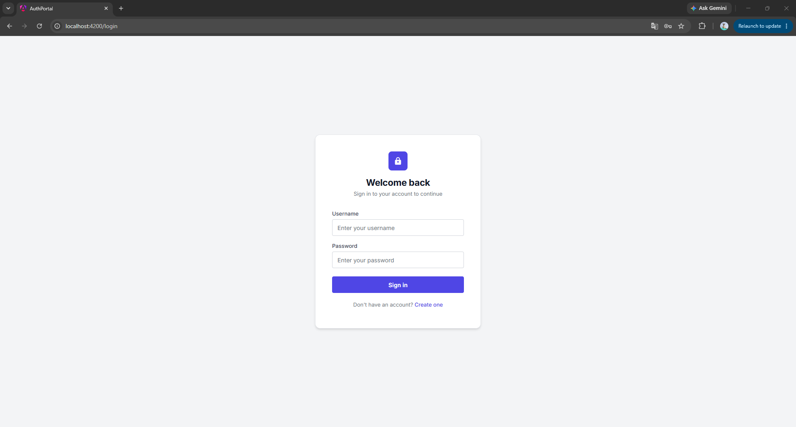
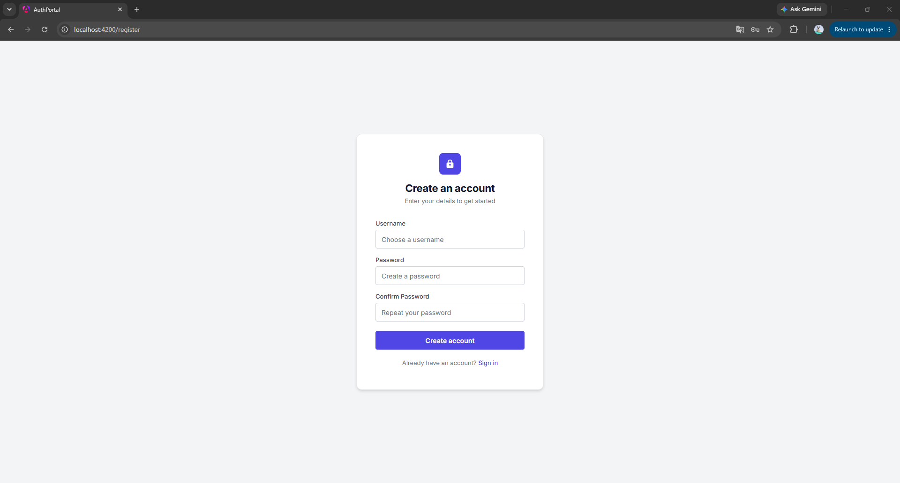
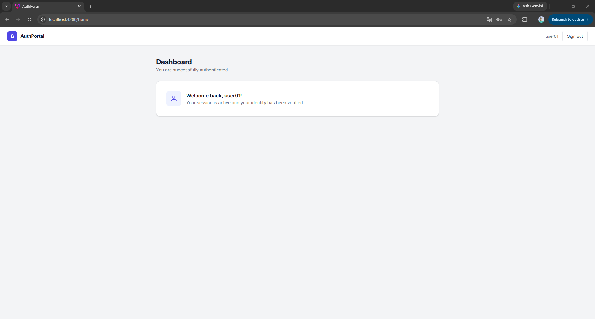
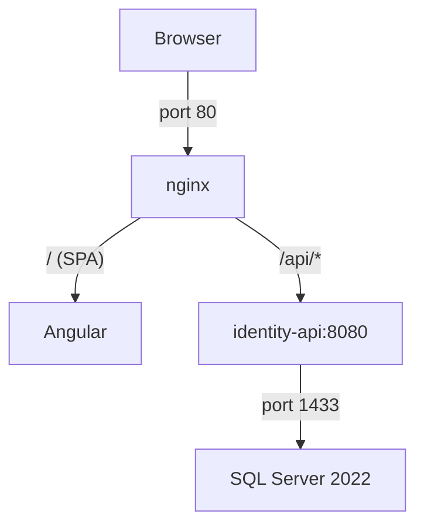

# Authentication Portal

A full-stack JWT authentication system running entirely in Docker. This branch (`dockerize`) containerizes the backend API, frontend, and database into a single Docker Compose stack.

## Screenshots

### Login


### Register


### Home


---

## Tech Stack

| Layer | Technology |
|---|---|
| Backend | ASP.NET Core 8, EF Core 8, SQL Server 2022 |
| Auth | JWT Bearer, BCrypt.Net |
| API Docs | Swagger / OpenAPI |
| Frontend | Angular 22, TypeScript |
| Web Server | nginx (Alpine) |
| Infrastructure | Docker, Docker Compose |

---

## Architecture



Three Docker services are orchestrated by Compose:

| Container | Role | Exposed Port |
|---|---|---|
| `mssql_db` | SQL Server 2022 database | 1433 (host) |
| `portal_api` | ASP.NET Core 8 REST API | internal 8080 only |
| `portal_web` | Angular SPA served by nginx | 80 (host) |

nginx acts as a reverse proxy: requests to `/api/` are forwarded to `identity-api:8080`, while all other requests serve the Angular SPA with HTML5 routing support (`try_files`).

---

## Prerequisites

- [Docker Desktop](https://www.docker.com/products/docker-desktop/) installed and running
- Ports **80** and **1433** must be free on your machine

---

## Quick Start

```bash
# 1. Clone and switch to this branch
git clone <repo-url>
cd Authentication_Portal
git checkout dockerize

# 2. Build images and start all services
docker compose up --build
```

On first run, SQL Server needs a few seconds to initialize before the API connects. The API automatically applies all EF Core migrations on startup — no manual `dotnet ef` commands needed.

Open the app at: **http://localhost**

---

## Services & Docker Details

### SQL Server (`mssql_db`)
- Image: `mcr.microsoft.com/mssql/server:2022-latest`
- SA password: `Password123!` (development only)

### API (`portal_api`)
- Multi-stage build: SDK 8.0 for compile, ASP.NET 8.0 runtime image
- Receives its connection string via environment variable, overriding `appsettings.json`
- Automatically runs EF Core migrations (`db.Database.Migrate()`) on every startup
- Not exposed to the host — only reachable from within the Docker network

### Frontend (`portal_web`)
- Multi-stage build: Node 24 to compile Angular, then nginx:alpine to serve
- nginx proxies `/api/` to the API container and serves the SPA for all other routes

---

## Environment Variables

These are set in `docker-compose.yml` for development use:

| Variable | Service | Value |
|---|---|---|
| `ACCEPT_EULA` | sqlserver | `Y` |
| `MSSQL_SA_PASSWORD` | sqlserver | `Password123!` |
| `ConnectionStrings__DefaultConnection` | identity-api | SQL Server connection string |

JWT settings (`Secret`, `Issuer`, `Audience`, `ExpirationHours`) are read from `appsettings.json` inside the API image.

> **Security notice:** Credentials are hardcoded for local development only. Replace all secrets before any production deployment.

---

## API Endpoints

| Method | Endpoint | Auth Required | Description |
|---|---|---|---|
| `POST` | `/api/auth/register` | No | Register a new user |
| `POST` | `/api/auth/login` | No | Login and receive a JWT |
| `GET` | `/api/auth/me` | Yes (Bearer) | Get the authenticated user's info |

> Swagger UI is only available when running the API locally in Development mode (`https://localhost:7011/swagger`). It is not exposed through nginx in the Docker setup.

---

## Authentication Flow

```
Register
    ↓
Password hashed with BCrypt
    ↓
Stored in SQL Server
    ↓
Login
    ↓
JWT token generated (6-hour expiry)
    ↓
Angular stores token in Local Storage
    ↓
Protected request to GET /api/auth/me (Bearer token)
    ↓
Authenticated username displayed on Home page
```

---

## Project Structure

```
Authentication_Portal/
├── docker-compose.yml
├── docs/                                        # Screenshots
│
├── Authentication.Portal.Identity.Api/          # Backend
│   ├── Dockerfile
│   └── Authentication.Portal.Identity.Api/
│       ├── Controllers/
│       ├── Services/
│       ├── Repositories/
│       ├── Data/
│       └── Migrations/
│
└── authentication-portal-identity-web/          # Frontend
    ├── Dockerfile
    ├── nginx.conf
    └── src/
        └── app/
            ├── pages/
            ├── services/
            ├── guards/
            └── interceptors/
```

---

## Useful Docker Commands

```bash
# Build and start all containers
docker compose up --build

# Start without rebuilding
docker compose up

# Stop all containers
docker compose down

# Stop and remove volumes (wipes the database)
docker compose down -v

# Follow logs for all services
docker compose logs -f

# Follow logs for a specific service
docker compose logs -f identity-api

# Rebuild a single service
docker compose build portal_api
```

---

## Local Development (Without Docker)

### Backend

1. Update the connection string in `Authentication.Portal.Identity.Api/appsettings.json` to point to your local SQL Server instance
2. Apply migrations and run:

```bash
cd Authentication.Portal.Identity.Api
dotnet ef database update
dotnet run
```

Swagger: `https://localhost:7011/swagger`

### Frontend

```bash
cd authentication-portal-identity-web
npm install
ng serve
```

App: `http://localhost:4200`

The dev proxy (`proxy.conf.json`) forwards `/api` requests to `http://localhost:5241`.
